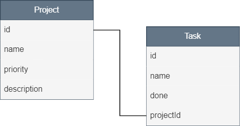

# Nodejs RESTAPI sqlite | typescript

This is a simple REST API using Hexagonal Architecture
- nodejs
- typescript
- express
- sqlite
- sequelize
- jest / supertest 
- rsdi 

# Modeling
This is the basic relationship that i am using

